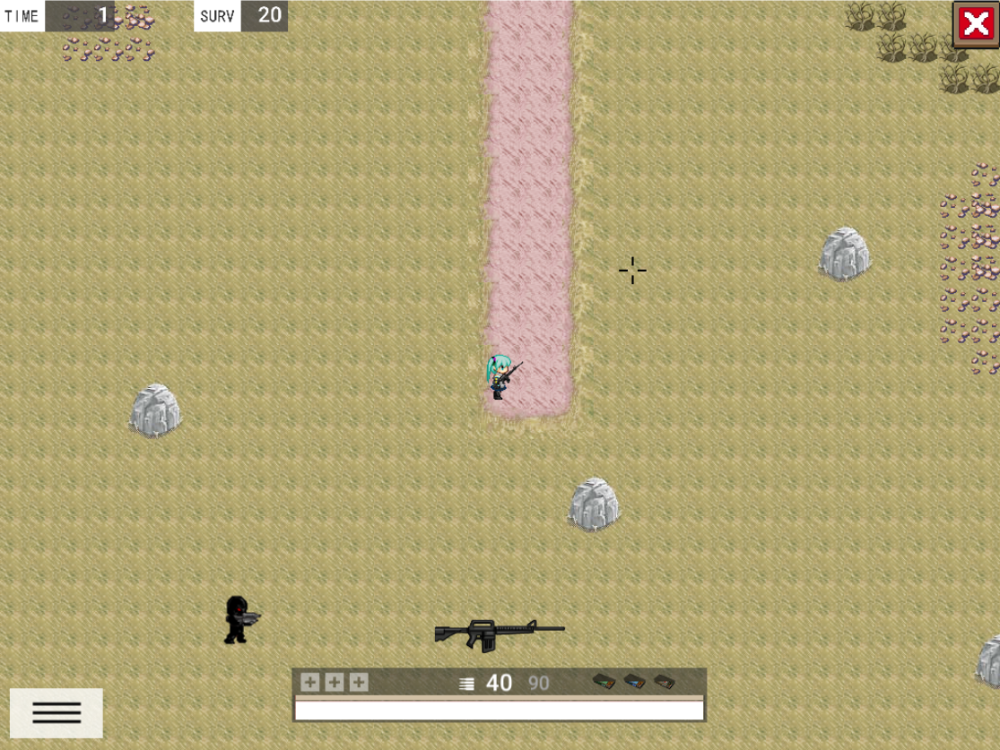
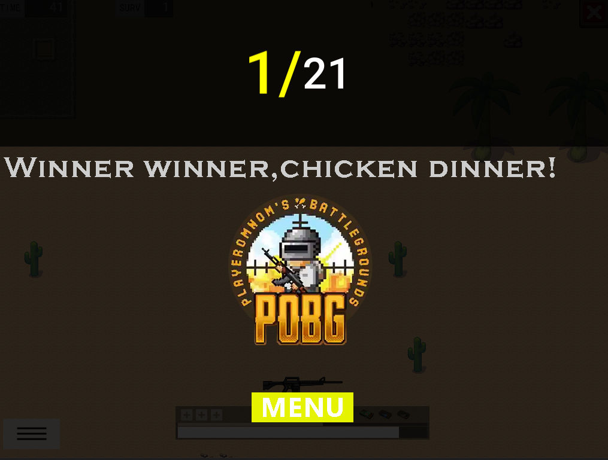
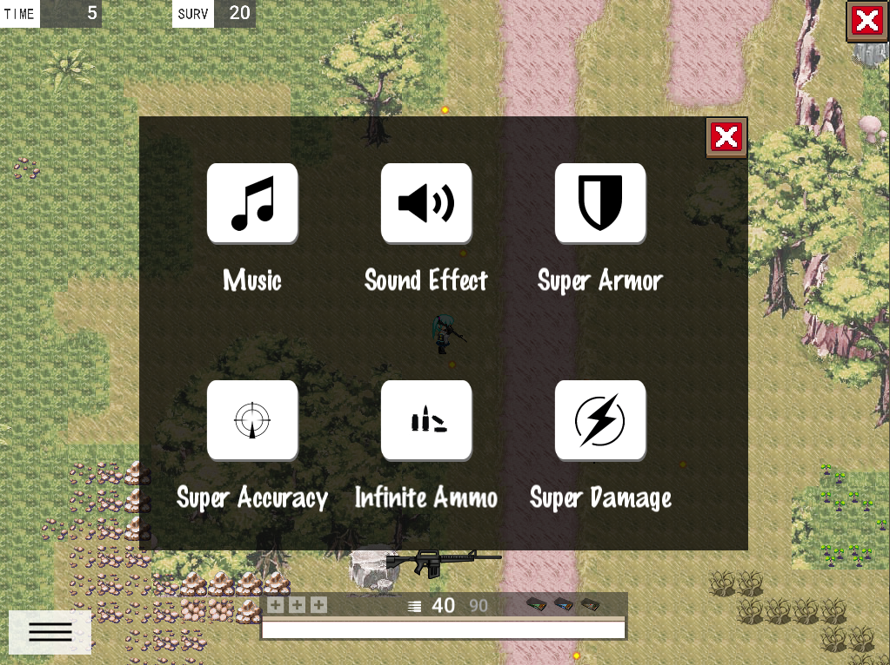

# Miku's Bizarre Adventure 项目文档

>同济大学软件学院2021年高级程序设计（荣）课程项目

## 项目信息
- 项目选题：**鸡地求生**
- 项目名称：进击的Miku
- 项目地址：[raetselhaftesKEN/SETerminal](https://github.com/raetselhaftesKEN/SETerminal)


## 项目成员 && 贡献占比
|姓名 | 学号 | 贡献比<br>以平均值为100% | 贡献比<br>以总分为100% | 班级 |
| --- | --- | :-----: | :----: | :---: |
| 杨孟臻 | 1953243 | 100% | 33.3% | 朱老师 |
| 孟　宇 | 1951477 | 100% | 33.3% | 朱老师 |
| 戴仁杰 | 1951650 | 100% | 33.3% | 朱老师 |

## 分工
| 组员 | 完成项 |
| --- |  :---: |
| 杨孟臻 | 美工、交互体验设计、武器与子弹、摄像机、UI设计、跨平台移植 |
| 孟　宇 | 游戏架构、掉落物、道具交互、角色与动画、场景与切换、联机 |
| 戴仁杰 | 地图素材制作、菜单、障碍物封装、音乐播放、多种外挂、联机 |

## 进度时间线
| 日期 | 功能 | 
| :---:  | ---- |
| 4.30	| 项目创建  |
| 5.20	| 学习git，cocos2d有关知识，搭建最初的游戏demo
| 5.23	| 设计封装了player、item类，绘制了第一张地图
| 5.29	| 完善player类，设计基类character
| 5.30	| 实现了character的运动动画
| 6.1   | 第一次增加了血条UI
| 6.2	  | 实现了医疗包的拾取和使用<br>实现了道具类的交互
| 6.3  	| 完成封装Obstacle类<br>完成封装Weapon类
| 6.5  	| 实现了武器的丢弃和拾取<br>初步尝试播放音乐
| 6.6  	| 初步尝试使用摄像机
| 6.8 	| 正式完成摄像机类<br>封装了FightScene类
| 6.11	| 初步完成封装UI<br>完成封装settingLayer类
| 6.15	| 增加Timer、SurvivorCounter和UI显示物品<br>更新完整地图与障碍物
| 6.19	| UI,AI,菜单效果等各种细节的完善<br>联网实现与测试<br>Android移植<br>整个游戏循环完整建立<br>外挂效果全部实现
| 6.20	| 结算界面UI<br>毒雾效果<br>所有枪支音效细化<br>完成项目文档<br>完成答辩ppt
| 每天	| 修复各种bug以及写新的bug

## 类继承关系设计


具体类在代码中体现，一般一个文件 (.h + .cpp) 就是一个类。

## 主要难点与解决
1. cocos封装的chipmunk物理引擎有一定缺陷，可能是由于帧率刷新的问题，静态刚体无论如何调节参数，都显得十分柔软。因此为了避免穿透墙壁和障碍物，用检查坐标的方式重新封装了障碍物类的碰撞检测。
2. 悬垂指针的问题。cocos的独特内存管理机制导致了大量对象被意外销毁的情况，在丢弃武器与拾起武器以及场景切换、掉落物生成等方面尤其明显。通过学习retain方法得以解决。
3. 场景内的动态添加与释放节点不能直接进行，通过学习使用schedule、update系列回调方法解决。
4. cocos网络编程教程与实例都非常少，并且版本大多十分古老，难以学习，最终通过自学其他网络编程库实现了弱联机模式。

## 评分项完成度
- 基本功能
  - [x] 开始界面
  - [x] 背景音乐
  - [x] 退出功能
  - [x] 计时系统
  - [x] 障碍物、边界
  - [ ] 联网
    - [x] 支持AI和其他玩家加入，但不与其他玩家同屏作战 
    - [ ] 创建房间和加入房间
  - [x] 键盘控制人物走动、翻滚、换弹，鼠标控制人物射击和射击方向
  - [x] 武器、弹药掉落和拾取
  - [x] 排名系统
  - [x] 吃鸡者
- Bonus
  - [x] 游戏设置
    - [x] 背景音乐开关
    - [x] 射击音效开关
  - [x] bonus机制
    - [x] 掉落医疗包、弹药、防弹衣等道具
    - [x] 空投支援武器
  - [x] 三种AI敌人
  - [x] 外挂
    - [x] 无限子弹
    - [x] 锁血
    - [x] 无后座力
    - [x] 一击必杀
- SuperBonus
  - [x] **能够移植到Android平台**

## 亮点
1. 爆炸效果和多种音效的搭配以及武器的各种细节设计带来极佳的游戏手感。
2. 物理引擎的使用。各个物体之间的碰撞消息均使用物理引擎发出，而在物理引擎表现不佳的障碍物类上，又通过自主设计碰撞算法解决了问题。
3. 丰富的枪支道具种类。
4. 一个能使敌人不停移动与射击的亮眼回调递归。
5. 利用Const.h管理全局常量。
6. 设计了一个独立于cocos体系之外的单例客户端类。
7. 全面且简洁的UI界面与动画，保证视觉效果的同时展示全部玩家所需要知道的信息
8. 能够移植到Android平台。

## C++新特性
* lambda表达式
  ```
  	auto delay = cocos2d::DelayTime::create(dodgeTime_);
	auto start = cocos2d::CallFunc::create([=]() {
		DodgeAnimeStart();
		});
	auto act = cocos2d::CallFunc::create([=]() {
		DodgeAnime(dodgeDirection);
		});
	auto end = cocos2d::CallFunc::create([=]() {
		DodgeAnimeEnd();
		});
	this->runAction(cocos2d::Sequence::create(start, act, delay, end, nullptr));
  ```
* 基于范围的for循环
  ```
  	Obstacle* obstacles = nullptr;
	if (runningScene != nullptr)
	{
		for (auto i : runningScene->getObstacles())
		{
			obstacles = i;
			if (obstacles != nullptr)
			{
				obstacles->collision(this);
			}
		}
	}
  ```
* auto类型推断
  ```
  项目几乎处处都有使用
  ```
* 初始化列表
  ```
  FightScene::FightScene(TMXTiledMap* map1, TMXTiledMap* map2, TMXTiledMap* map3, const Vector<Obstacle*>& obstacle, const int& serial)
	: tileMap1_(map1), tileMap2_(map2), tileMap3_(map3), obstacle_(obstacle), sceneSerial_(serial)
    {
	player_ = nullptr;
	dropNode_ = nullptr;
	mainCamera_ = nullptr;
	touchHolding_ = false;
    }

  ```

# Miku's Bizzare Adventure 游戏文档

## 游戏简介
**Miku's Bizzare Adventur**是一款战术射击类沙盒游戏，玩家扮演Miku，躲避毒雾，并与地图里不断出现的所有敌人进行一场真剑胜负。winner winner, chicken dinner!

## 游戏玩法
在游戏中，地图上会不断出现敌人，Miku必须活下来并不断击杀敌人，直到幸存者只剩自己，成为真正的吃鸡者。初始状态的Miku只有两把枪和一些子弹，现在开始，不断击杀敌人，利用他们掉落的医疗包和子弹，注意地图每60秒一次的空投支援武器，躲避毒雾，活到最后吧。

## 操作
| 键 | 动作 |
| --- | --- |
| 鼠标左键单击           |      射击|
| 鼠标左键按住           |      扫射(步枪与冲锋枪)|
| W键        |               上移|
| A键        |               左移|
| S键        |               下移|
| D键        |               右移|
| F键             |                  交互物品|
| R键                |              换弹|
| Q键                |              切换武器|
| E键                |              使用医疗包|
| G键                |              丢弃主武器|
| SPACE键       |              闪避(闪现)|
| ESC键              |            菜单栏|

## 联机模式使用方法
联机的客户端需要连接在同一局域网下，其中一台需要编译运行server.cpp作为服务器，每个参与游戏的客户端需要在游戏目录文件夹的network.txt中（如果没有，则创建一个）输入服务器的iPv4地址（在服务器端ipconfig获得），之后进入游戏时，选择start online即可。有玩家进入和退出游戏时，server程序会收到和发出相应的消息。

## 武器种类与属性
| 武器名 |    弹药类型     |    射速    |  单发伤害   |    换弹时间/s    |   弹夹容量   |  后坐力/后坐力回复    |
| :----: | :-----------: | :----------: | :---------: | :--------: | :----------: |:----------: |
|  AK47  | 762子弹 |10| 12 | 2 | 30  |  15/60  |
|  AKM  | 762子弹  | 8| 15 | 2 | 35 |   18/50  |
|  FAL  | 556子弹 | 2  | 40 | 3 | 20  | 30/60  |
|  M4  | 556子弹 | 15  | 10 | 3 | 40  | 8/80   |
|  MP5  | 9mm子弹 | 15  | 8 | 2.5 | 45| 5/100  |
|  SVD  | 9mm子弹 | 1  | 80 | 2 | 5  |  60/60  |

## 画面概览

* 游戏界面

* 吃鸡结算

* 设置菜单


# Miku's Bizzare Adventure 游戏文档(安卓版本)

## 游戏玩法

在游戏中，地图上会不断出现敌人，Miku必须活下来并不断击杀敌人，直到幸存者只剩自己，成为真正的吃鸡者。初始状态的Miku只有两把枪和一些子弹，现在开始，不断击杀敌人，利用他们掉落的医疗包和子弹，注意地图每60秒一次的空投支援武器，试着活到最后吧。

## 操作

| 键                             | 动作       |
| ------------------------------ | ---------- |
| 屏幕右侧滑动（接近操纵杆中心） | 瞄准       |
| 屏幕右侧滑动（远离操纵杆中心） | 射击       |
| 屏幕左侧滑动                   | 移动       |
| 虚拟按键A                      | 使用医疗包 |
| 虚拟按键B                      | 切换武器   |
| 虚拟按键C                      | 交互物品   |
| 虚拟按键D                      | 换弹       |

## 画面概览
+ 游戏界面


## 联系我们
> 杨孟臻 1610348804@qq.com
> 
> 孟宇  y.meng1@outlook.com
>
> 戴仁杰 1951650@tongji.edu.cn

## 致谢
* 感谢2020级同济大学软件工程荣誉课课程群一起受苦的群友们的陪伴
* 感谢www，zzy，xy(p)，nan等强无敌的学长们的帮助
* 感谢llt，yx等19软荣的降转同学的帮助
* 感谢温油的助教瑞瑞子gg
* [Course project of Tongji SSE OOP course 2020](https://github.com/PlusOneZ/OOPCourseProject)
* [Cocos2dx-VerySimpleDemo](https://github.com/PlusOneZ/Cocos2dx-VerySimpleDemo)
* [soul-knight](https://github.com/vegetable-yx/soul-knight)
* [@sunnyboychina](https://blog.csdn.net/sunnyboychina) 的cocos2d-x 4.0学习笔记